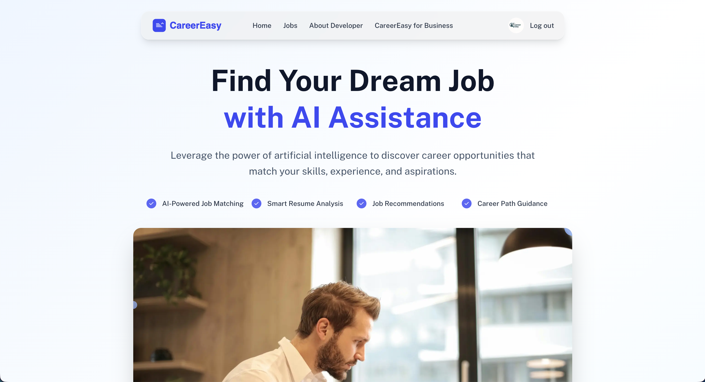
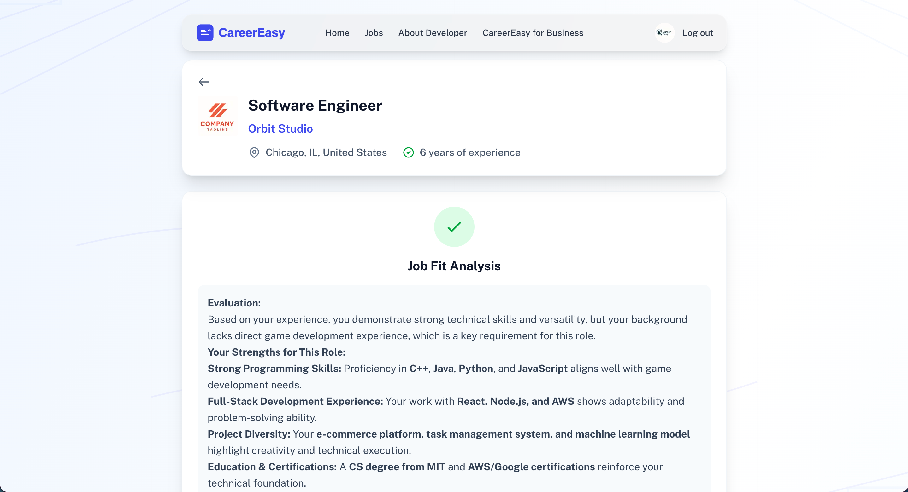
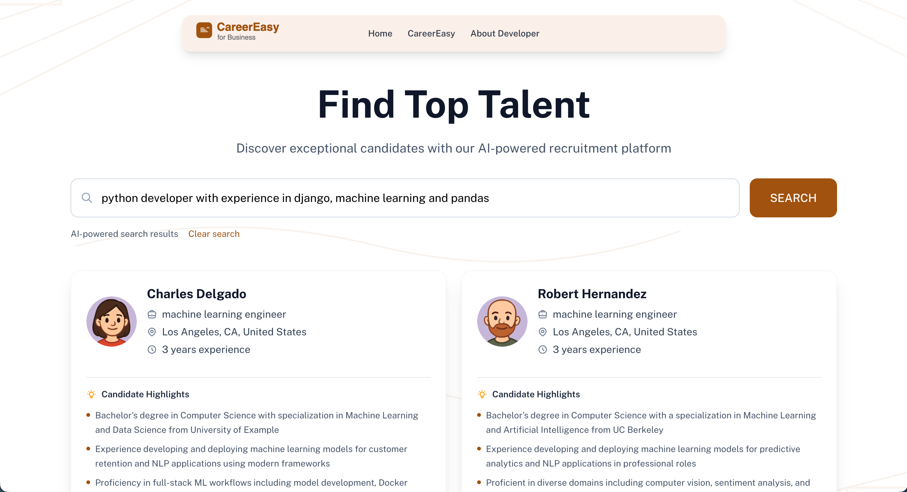
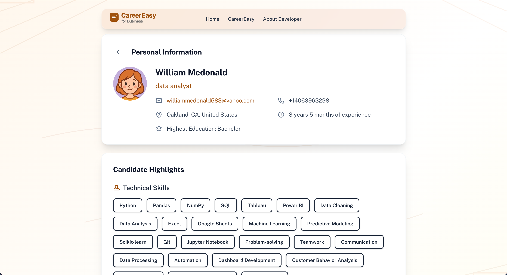

# CareerEasy
A Reasoning AI powered Job Board and Job Matching Website
## Features
- **Resume Parsing with AI Reasoning**: By leveraging reasoning models, experience and skills can be accurately extracted from resumes. Reasoning models are also capable of extrapolating relevant skills not explicitly stated in resumes.
- **AI Highlighting**: Every jobseeker has their most shining points in resume summarized by Generative AI and tweakable by users. Their highlights are highly visible to employers and useful for AI career matching.
- **Career Matching and Development Support**: Show jobseekers clear feedback on their fits over job postings and give helpful self-development paths for better competence.
- **Jobseeker Searching in Natural Language**: Employers can search for jobseekers directly using natural language queries.
## Technical Decisions
The idea of developing CareerEasy is to simplify some annoying steps in job seeking by leveraging AI.

Common annoyances include:
- ATS resume checkers can be stubborn. They can misinterpret information in your resume, and fail to match keywords in resume that are similar, but not identical to words in job requirements.
- Jobseekers' resumes can be too long for HRs to read. Sometimes good matches can be missed when their resumes are skimmed.
- Employers can not find good matches efficiently in a vast sea of applications

Therefore, in CareerEasy, every candidate is represented not only by their profiles, but also four lines of highlights summarized by AI. The AI highlighting prompt is also customizable to fit candidates' personal needs better.

A search bar is added to the employer homepage. HRs can simply type what they are looking for in natural language, and Generative AI will do the rest of the job. Matching candidates can be filtered out quickly so that HRs can find their profiles and reach them easily.

In CareerEasy, traditional ATS resume parsers are replaced by reasoning LLMs. They can adapt to resume reviewing better, with tolerance of typos and imperfect matches.

In the future, these features may be implemented:
- Import profile from LinkedIn
- Import company information and job postings from LinkedIn
- Choose different Generative AIs, including local deployed ones
- AI Resume Optimizer
- AI Networking Assistant

## Demo Screenshots

## Disclaimer on Usage of Generative AI
All test data, including resumes, job postings, profile pictures, company logos, etc., are generated either by Generative AI (ChatGPT and DeepSeek) or random number generators for development purposes only.

Cursor is used to assist the development of the website. Some parts of the code are AI generated and inspected by the developer.

Some crucial features of the website, including resume parsing, jobseeker searching, etc. require the use of generative AIs to function. 
The Generative AIs used in development are [DeepSeek R1](https://huggingface.co/deepseek-ai/DeepSeek-R1) (requests requiring reasoning) and [Deepseek V3](https://huggingface.co/deepseek-ai/DeepSeek-V3) (other requests), called directly from [DeepSeek API](https://api-docs.deepseek.com/).